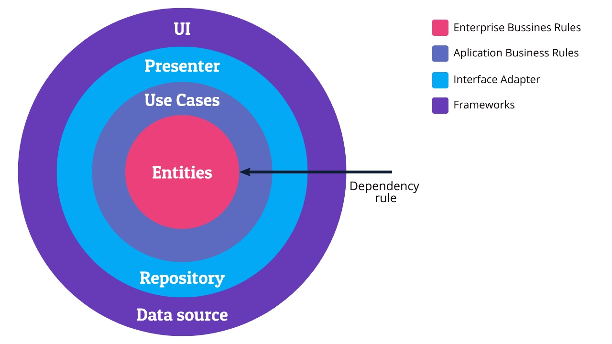
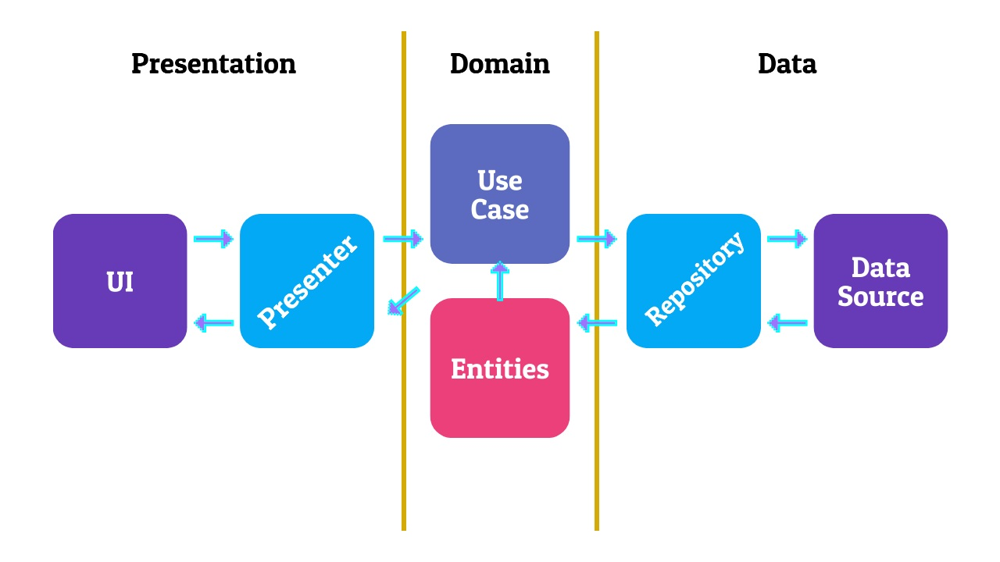

# SportsApp CleanArchitecture
[](https://circleci.com/gh/faridrama123/SportsAppCleanArchitecture)


## What is Clean Architecture?
Clean Architecture is a software engineering development architecture created by Uncle Bob (**Robert C. Martin**). The essence of this architecture is separation of concern. So that we can read the code in the project more easily.

In addition, the main idea of ​​using Clean Architecture is to produce a system that is **Independent of Framework**, **Testable**, **Independent of UI**, **Independent of Database**, and **Independent of External**.
This is an overview to represent Clean Architecture suggested by Robert C. Martin:


## Use this pattern in an Android project
In a typical android project it is divided into 3 layers like this:


 - **Presentation Layer** contains the UI and Presenter / ViewModel which will control the views. This UI will depend heavily on the Use Case.
 - **Domain Layer** contains Entities, Use Case, Repository Interface. This is the most core layer and is associated with business processes.
 - **Data Layer** contains Repository Implementation and DataSource which can be Local DataSource (database) and Remote DataSource (network).

## Modularization
Modularization is a technique of breaking an Android project into sections called modules. With modularization we will get a lot of advantages over implementing the monolith (only one part) in our project.


 ## License
 ```
    Copyright 2020 @faridrama123

   Licensed under the Apache License, Version 2.0 (the "License");
   you may not use this file except in compliance with the License.
   You may obtain a copy of the License at

       http://www.apache.org/licenses/LICENSE-2.0

   Unless required by applicable law or agreed to in writing, software
   distributed under the License is distributed on an "AS IS" BASIS,
   WITHOUT WARRANTIES OR CONDITIONS OF ANY KIND, either express or implied.
   See the License for the specific language governing permissions and
   limitations under the License.
 ```
